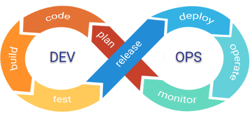
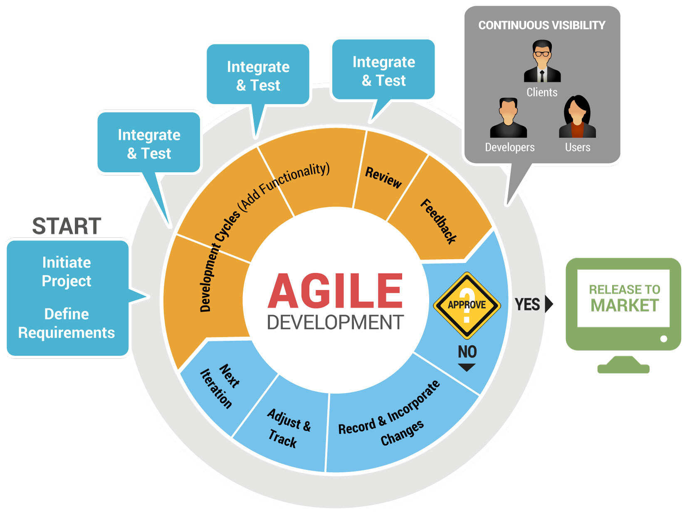

# CNC - Yousaf - 2022/06/19

- Course Outline

  | Q1         | Q2                    | Q3                    | Q4        |
  | ---------- | --------------------- | --------------------- | --------- |
  | Linux      | Git                   | NODE JS               | AWS Cloud |
  | Docker     | Advance JS            | Express               |           |
  | Kubernetes | React                 | GraphQL (server side) |           |
  | HTML       | Redux                 |                       |           |
  | CSS        | GraphQL (client side) |                       |           |
  | JS         |                       |                       |           |

## CLOUD NATIVE COMPUTING

- The Modern Way To Develop Software

### TRADITIONAL WAY OF COMPUTING?

- Before we start discussing Cloud native computing, let’s first look at what was happening as a traditional way of computing
  - Traditional way/architecture of computing is also known as Monolithic computing
  - As a definition word monolithic means “very large, united, and difficult to change”
  - A monolithic architecture is the traditional unified model for the design of a software program
  - Monolithic, in this context, means composed all in one piece
  - Monolithic software is designed to be self-contained meaning having all that is needed, in itself
  - Components/Layers of the program are interconnected and interdependent
  - In a tightly-coupled architecture, each component and its associated components must be present in order for code to be executed or compiled
  - Application is too large and complex to fully understand and made changes fast and correctly
  - You must re-deploy the entire application on each update
  - The size of the application can slow down the start-up time
  - Another problem with monolithic applications is reliability. Bug in any module can potentially bring down the entire process
  - Monolithic applications has a barrier to adopting new technologies.
    - Since changes in frameworks or languages will affect an entire application it is extremely expensive in both time and cost

### MICROSERVICE ARCHITECTURE

- The microservice architectural style is an approach to developing a single application as a suite of small services
- Each runs in its own process and communicates with lightweight mechanisms, often an HTTP resource API
- Microservices do have distinct advantages:
  - Better Organization:
    - Microservice architectures are typically better organized
    - Each microservice has a very specific job, and it is not concerned with the jobs of other components
  - Decoupled:
    - Decoupled services are also easier to change, update and re-configure to serve the purposes of different apps
    - They also allow for fast, independent delivery of individual parts within a larger, integrated system
  - Performance:
    - Under the right circumstances, microservices can also have performance advantages depending on how they’re organized
    - It’s possible to isolate hot services and scale them independently of the rest of the app
- REST API

  ```
  app.get("/url", (req, res, next) => {
    res.json(["Tony","Lisa","Michael","Ginger","Food"]);
  });
  ```

### WHAT IS CLOUD?

- In single line cloud can be described as a “communications network”
- The word "cloud" often refers to the Internet, and more precisely to some datacenter full of servers that is connected to the Internet
- A cloud can be a wide area network (WAN) like the public Internet or a private, national or global network. The term can also refer to a local area network (LAN) within an organization
- Type of clouds
  - Private Cloud
    - Deploying cloud computing internally,
    - Private cloud employs cloud computing within a company's own local or wide area networks
  - Public Cloud
    - A cloud computing service on the Internet that is available to the general public
    - Commercial cloud providers like Amazon, Google cloud, Azure etc
  - Hybrid Cloud
    - The use of both private and public clouds to provide an organization's computing needs

### WHAT IS CLOUD NATIVE?

- Cloud Native Computing Foundation (CNCF) which is an open source software foundation dedicated to making cloud native computing universal and sustainable, describe cloud native as,

  ```
  Cloud native technologies empower organizations to build and run scalable applications in modern, dynamic environments such as public, private, and hybrid clouds
  ```

- Other definition of Cloud Native Computing could be

  ```
  An approach that builds software applications as microservices and runs them on a containerized and dynamically orchestrated platform to utilize the advantages of the cloud computing model
  ```

- Let’s get into detail and simplify to understand what we just heard
  - CLOUD NATIVE is about HOW applications are created and deployed, NOT WHERE
  - Cloud-native app development typically includes
    - Devops,
    - Agile methodology,
    - Microservices,
    - Cloud computing platforms,
    - Containerize application,
    - Orchestration system,
    - Continuous delivery
  - In short, every new and modern method of application deployment

### DevOps

- Devops cycle

  

### AGILE DEVELOPMENT

- Agile methodology is described as an “iterative” and “incremental” approach
- Agile developers visualize the software as a combination of complex parts that interacts with each other rather than a large block of structure
- Actually, in waterfall method, development team will get only single chance to get each phase (like design, development, testing etc) of a project
- Whereas in an agile methodology, these phases are continually revisited periodically to identify/understand the project’s progress and direction
- The “inspect-and-adapt” approach from Agile methodology, greatly reduces development costs and time to market the product because here teams can develop the software while gathering changes in requirements
- The stakeholders can provide feedback to the development team to improve the quality of the product
- Agile development does save lot of resource which could have spent on something not needed anymore

  

### MICROSERVICES

- MICROSERVICES-ORIENTED

  - Cloud native applications are built as a system of microservices
  - The general idea of this architectural style is to implement a system of multiple, relatively small applications. These are called microservices.
  - They work together to provide the overall functionality of your system
  - Each microservice realizes
    - Exactly one functionality,
    - Has a well-defined boundary and API (Application programming interface - used for communication),
    - Gets developed and operated by a relatively small team

- BENEFITS OF MICROSERVICES

  - A lot easier to implement and understand a smaller application that provides one functionality, instead of building a large application that does everything
  - That speeds up development and makes it a lot easier to adapt the service to changed or new requirements
  - You need to worry a lot less about unexpected side effects of a seemingly small change, and you can focus on the development task at hand
  - It also allows you to scale more efficiently
  - And even if you only use a small part of the monolith, you still need to acquire additional resources for the other, unused parts but in a cloud environment, you pay for the usage of hardware resources

- CHALLENGES USING MICROSERVICES
  - There is a saying: There's no such thing as a Free Lunch
  - Microservices remove some complexity from the services themselves and provide better scalability, but you’re now building a distributed system
  - That adds a lot more complexity on the system level
  - To make sure that dependent services find each other and communicate efficiently its a challenging task when number of microservices are many
  - You also need to handle slow or unavailable services so that they don’t affect the complete system
  - The distributed nature of your system also makes it a lot harder to monitor and manage your system in production
  - Instead of a few monoliths, you now need to monitor a system of microservices, and for each service, there might be several instances that run in parallel

### CLOUD COMPUTING PLATFORMS

- Cloud computing is the ON demand availability of computer system resources, especially data storage and computing power, without direct active management by the user
- The term is generally used to describe data centers commercially available to many users over the Internet, they are Cloud Computing Platforms
- Large clouds, predominant today, often have functions distributed over multiple locations from central servers. If the connection to the user is relatively close, it may be designated an edge server.
- An edge server also called content delivery network or content distribution network (CDN) is a geographically distributed network of proxy servers and their data centers. The goal is to provide high availability and high performance by distributing the service spatially relative to end-users
- Clouds may be limited to
  - A single organization (enterprise clouds)
  - Be available to many organizations (public cloud)
  - A combination of both (hybrid cloud)
- The largest public cloud is Amazon AWS. There are many others like Google cloud, microsoft Azure, Alibaba cloud, IBM cloud etc
- Advocates of public and hybrid clouds note that cloud computing allows companies to avoid or minimize up-front IT infrastructure costs
- Experts also claim that cloud computing allows enterprises to get their applications up and running faster, with improved manageability and less maintenance, and that it enables IT teams to more rapidly adjust resources to meet fluctuating and unpredictable demand
- Cloud providers typically use a "pay-as-you-go" model
