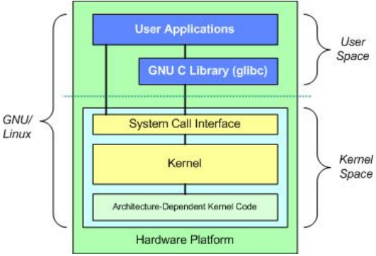

# Chapter Two: Understanding Linux

- OS Architecture
- Different Flavors for Beginners

## 2.1 Linux Architecture

- Linux architecture can be divided into two spaces.

  1.  User Space
      - This is where applications are used.
      - The GNU C library, in the User Space, is the interface that connects to the kernel and transitions between User and Kernel space. This uses all available memory.
  2.  Kernel Space

      - All Kernel services are processed here. The Kernel space is divided into 3 parts.

        - System Call Interface
          - A User process can access Kernel space through a System Call.
          - When a System Call is performed, arguments are passed from User to Kernel space.
          - This is the layer that implements basic functions.
        - Kernel Code

          - This is architecture-independent code, and can be seen in all architectures that Linux supports.

            

        - Architecture-Dependent Kernel Code

          - This is the layer for platform-specific codes.

            

## 2.2 Linux Distributions

- Each Linux distro consists of a Linux kernel plus utilities and configuration files
- Let’s take a look at how several of the popular distros differ from each other based on the following criteria:

  1. Availability
     - Linux is a free software, but companies offering a support contract and proprietary components offer it for a fee.
     - Red Hat Enterprise and SUSE Enterprise both offer Linux commercially, but they also have the free alternatives - Fedora and openSUSE
  2. Package Format
     - Linux distros come in packages.
     - Packages are files grouped into one single file.
     - RPM is the most commonly used
  3. Release Cycle

     - How often a distro releases new software.
     - Shorter release cycles mean latest software is provided in the shortest possible time.
     - Longer release cycles aim to provide more stable environments.
     - Ubuntu offers a long term support (LTS) version with a longer release cycle which offers a more stable environment.
     - Also offers the latest software with a 6 month release cycle.

     | Distribution | Availability          | Package Format | Release Cycle |
     | ------------ | --------------------- | -------------- | ------------- |
     | Arch         | Free                  | Pacman         | Rolling       |
     | CentOS       | Free                  | RPM            | Approx. 2-yr  |
     | Debian       | Free                  | Debian         | 2-yr          |
     | Fedora       | Free                  | RPM            | Approx. 6-mo  |
     | Gentoo       | Free                  | Ebuild         | Rolling       |
     | Mint         | Free                  | Debian         | 6-month       |
     | openSUSE     | Free                  | RPM            | 8-month       |
     | Red Hat      | Enterprise Commercial | RPM            | Approx. 2-yr  |
     | Scientific   | Free                  | RPM            | Approx. 6-mo  |
     | Slackware    | Free                  | Tarballs       | Irregular     |
     | SUSE         | Enterprise Commercial | RPM            | 2-3 years     |
     | Ubuntu       | Free                  | Debian         | 6-month       |

### 2.2.1 Choosing the Right Distribution

- To choose the right distro for you, please consider all previously mentioned points. In addition, research these:
  1. Desktop Environment
     - Find out if the particular distribution that you’re eyeing has a basic look and feel that you like.
     - Is it customizable?
  2. Hardware Compatibility
     - Depending on the hardware that you are using, some drivers may not be available.
     - Check from online resources first to know which ones can be supported out-of-the-box.
  3. Community Support
     - Find a distro with a large online community.
     - The bigger the community, the easier to get support and find documentation.
