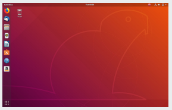

# Chapter Four: Your First Linux Experience

## 4.1 Turning on Your PC

- Once Linux boots, a graphical login screen will be shown.
- Other distros don’t require login on startup.
- Each distro uses the root username for administrator access.
- The desktop that comes up is either KDE or GNOME.

  

## 4.2 Getting to Know Shell

- Open Terminal.
- The shell is where you can run executable files and shell scripts.
- The shell is what we call the command line
- Commands are written using this general syntax:
  - command option1 option2 … optionN
- Let’s run some commands

  | Command | Argument        | Description                                                                      |
  | ------- | --------------- | -------------------------------------------------------------------------------- |
  | uptime  |                 | Display curren time, uptime, no of users and load average                        |
  | uanme   |                 | Print system information                                                         |
  | uanme   | -s              | Print the operating system name                                                  |
  | uanme   | -r              | Print the operating system release                                               |
  | uanme   | -v              | Print the operating system version                                               |
  | uanme   | -a              | Print all information (machine, processer and OS)                                |
  | man     | &lt;command&gt; | Display the user manual of any command that we can run on the terminal (offline) |
  | su      | -               | switch to root user                                                              |

## 4.3 Linux Desktops

- two commonly used GUIs

  - GNOME
  - KDE

    | Criteria                                                         | GNOME                                                                                                                               | KDE                                                                                                                                                                     |
    | ---------------------------------------------------------------- | ----------------------------------------------------------------------------------------------------------------------------------- | ----------------------------------------------------------------------------------------------------------------------------------------------------------------------- |
    | Availability                                                     | Free                                                                                                                                | Free                                                                                                                                                                    |
    | Minimum System Requirements                                      | 700 MHz CPU, 768 MB RAM                                                                                                             | 1 Ghz CPU, 615 MB RAM                                                                                                                                                   |
    | Development Priorities                                           | Focuses on freedom, accessibility, and developer-friendliness                                                                       | Provides an aesthetically pleasing website with great configurability                                                                                                   |
    | Customization Experience                                         | The interface is simple to use and great for first-time Linux users, advanced users may find its customization settings as limiting | Allow for versatile configuration that creates great looking desktop, but the user has to learn to navigate the options. Customization makes it more resource-intensive |
    | Default appearance (Note that both offers customization options) | Default setting: Toolbar at the top and a dock that pops out featuring application icons                                            | Default setting: toolbar at the bottom and a main menu.                                                                                                                 |
    | Universal Search                                                 | Uses text-based search functionality                                                                                                | Uses text-based and menu-based navigation                                                                                                                               |
    | Resource Usage and User Experience                               | Less resource-intensive than KDE                                                                                                    | Good for users who came from Windows OS                                                                                                                                 |

## 4.4 Navigating the Linux Filesystem

- Navigating the Linux Filesystem

  | Sr. No. | Path        | Files Contained                                                               |
  | ------- | ----------- | ----------------------------------------------------------------------------- |
  | 1       | /           | Single root directory – file system base                                      |
  | 2       | /bin        | Executable files such as Linux commands cat,cp,ls                             |
  | 3       | /boot       | Files that the boot loaders access during start-up–including the Linux kernel |
  | 4       | /dev        | Files for the different hardware/devices                                      |
  | 5       | /etc.       | Initialization scripts and system config files                                |
  | 6       | /home       | User directories                                                              |
  | 7       | /lib        | Library files which includes driver modules                                   |
  | 8       | /lost+found | For lost files                                                                |
  | 9       | /media      | Mounting removal media filesystems                                            |
  | 10      | /mnt        | Temporary directory for mounted filesystems                                   |
  | 11      | /opt        | For storing application packages                                              |
  | 12      | /proc       | Information on Linux processes                                                |
  | 13      | /root       | Root user home directory                                                      |
  | 14      | /sbin       | Executable files for commands used by root user                               |
  | 15      | /srv        | For services hosted by the system (e.g. FTP, web)                             |
  | 16      | /tmp        | Temporary directory – deleted during system reboot                            |
  | 17      | /usr        | Contains subdirectories for program files                                     |
  | 18      | /var        | Log files                                                                     |

  | Commands | What it does                                                                    |
  | -------- | ------------------------------------------------------------------------------- |
  | ls       | List down all the contents of a director                                        |
  | cd /bin/ | Changes directory and goes to bin dir                                           |
  | cd ~     | the tilde (~) sign signifies the user’s home dir – change dir to home directory |
  | cd.      | Means to change directory one level up.                                         |
  | mkdir    | A command used to create directories                                            |
  | pwd      | display the directory where you are currently in.                               |

  | Commands                                | What it does                                                                                                                                                                          |
  | --------------------------------------- | ------------------------------------------------------------------------------------------------------------------------------------------------------------------------------------- |
  | cat /home/edulaney/files/file1.txt      | Command to print all the contents of file1.txt in the screen                                                                                                                          |
  | cp /home/ /tmp/                         | Copy contents of /home/ to /tmp                                                                                                                                                       |
  | mv /home/edulaney/files/file1.txt /tmp/ | move the file file1.txt to the /tmp/ directory. You can also use this command to move the entire directory to another directory                                                       |
  | rm file1.txt                            | Delete the file file1.txt. Take extra precaution in using the rm command, especially when you are logged in as root.                                                                  |
  | find / -name “linux\*”                  | The find command is a powerful tool that you can use when searching using the command line. The command here will search for any file or directory with a name that starts with linux |

## 4.5 Shutting Down your PC
