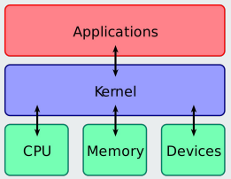
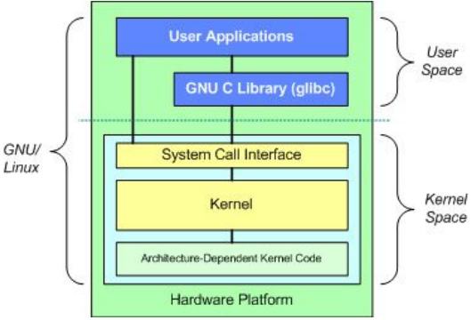
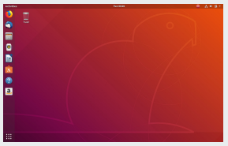

# CNC - Yousaf - 2022/07/03

## Linux for Beginners

### Agenda

1. Getting Started
2. Understanding Linux
3. Your First Linux Experience
4. Post Installation Activities
5. Using the Linux Command Line
6. Basic Administration & Security
7. Introduction to Scripting

### Chapter Two: Understanding Linux

- OS Architecture
- Different Flavors for Beginners

##### 2.1 Linux Architecture

- Linux architecture can be divided into two spaces.

  1.  User Space
      - This is where applications are used.
      - The GNU C library, in the User Space, is the interface that connects to the kernel and transitions between User and Kernel space. This uses all available memory.
  2.  Kernel Space

      - All Kernel services are processed here. The Kernel space is divided into 3 parts.

        - System Call Interface
          - A User process can access Kernel space through a System Call.
          - When a System Call is performed, arguments are passed from User to Kernel space.
          - This is the layer that implements basic functions.
        - Kernel Code

          - This is architecture-independent code, and can be seen in all architectures that Linux supports.

            

        - Architecture-Dependent Kernel Code

          - This is the layer for platform-specific codes.

            

#### 2.2 Linux Distributions

- Each Linux distro consists of a Linux kernel plus utilities and configuration files
- Let’s take a look at how several of the popular distros differ from each other based on the following criteria:

  1. Availability
     - Linux is a free software, but companies offering a support contract and proprietary components offer it for a fee.
     - Red Hat Enterprise and SUSE Enterprise both offer Linux commercially, but they also have the free alternatives - Fedora and openSUSE
  2. Package Format
     - Linux distros come in packages.
     - Packages are files grouped into one single file.
     - RPM is the most commonly used
  3. Release Cycle

     - How often a distro releases new software.
     - Shorter release cycles mean latest software is provided in the shortest possible time.
     - Longer release cycles aim to provide more stable environments.
     - Ubuntu offers a long term support (LTS) version with a longer release cycle which offers a more stable environment.
     - Also offers the latest software with a 6 month release cycle.

     | Distribution | Availability          | Package Format | Release Cycle |
     | ------------ | --------------------- | -------------- | ------------- |
     | Arch         | Free                  | Pacman         | Rolling       |
     | CentOS       | Free                  | RPM            | Approx. 2-yr  |
     | Debian       | Free                  | Debian         | 2-yr          |
     | Fedora       | Free                  | RPM            | Approx. 6-mo  |
     | Gentoo       | Free                  | Ebuild         | Rolling       |
     | Mint         | Free                  | Debian         | 6-month       |
     | openSUSE     | Free                  | RPM            | 8-month       |
     | Red Hat      | Enterprise Commercial | RPM            | Approx. 2-yr  |
     | Scientific   | Free                  | RPM            | Approx. 6-mo  |
     | Slackware    | Free                  | Tarballs       | Irregular     |
     | SUSE         | Enterprise Commercial | RPM            | 2-3 years     |
     | Ubuntu       | Free                  | Debian         | 6-month       |

##### 2.2.1 Choosing the Right Distribution

- To choose the right distro for you, please consider all previously mentioned points. In addition, research these:
  1. Desktop Environment
     - Find out if the particular distribution that you’re eyeing has a basic look and feel that you like.
     - Is it customizable?
  2. Hardware Compatibility
     - Depending on the hardware that you are using, some drivers may not be available.
     - Check from online resources first to know which ones can be supported out-of-the-box.
  3. Community Support
     - Find a distro with a large online community.
     - The bigger the community, the easier to get support and find documentation.

### Chapter Three: Linux Installation

- Install Linux

### Chapter Four: Your First Linux Experience

#### 4.1 Turning on Your PC

- Once Linux boots, a graphical login screen will be shown.
- Other distros don’t require login on startup.
- Each distro uses the root username for administrator access.
- The desktop that comes up is either KDE or GNOME.

  

#### 4.2 Getting to Know Shell

- Open Terminal.
- The shell is where you can run executable files and shell scripts.
- The shell is what we call the command line
- Commands are written using this general syntax:
  - command option1 option2 … optionN

##### Special Characters

| Character | Description            |
| --------- | ---------------------- |
| /         | Root Directory         |
| ~         | Home directory of user |
| $         | System user            |
| #         | Root user              |

##### Commands

| Command           | Argument                                 | Description                                                            |
| ----------------- | ---------------------------------------- | ---------------------------------------------------------------------- |
| cd                | &lt;directory_path&gt;                   | Changes directory and goes to dir_path directory                       |
| cd                | ~                                        | change dir to home directory                                           |
| cd                | /                                        | Move to root                                                           |
| cd                | ..                                       | Means to change directory one level up                                 |
| ls                |                                          | List down all the contents of current directory                        |
| ls                | &lt;directory_path&gt;                   | List down all the contents of a directory                              |
| ls                | -l                                       | List down all the contents of a directory along with extra information |
| pwd               |                                          | Display the current directory                                          |
| clear             |                                          | Clear terminal window                                                  |
| tab               |                                          | Auto complete command                                                  |
| double tab        |                                          | List of all commands linked to some command                            |
| mkdir             | &lt;directory_name&gt;                   | Create directory                                                       |
| mkdir             | &lt;directory_path&gt;                   | Create sub directory                                                   |
| mkdir             | &lt;directory_path&gt; -p                | Create multiple directory                                              |
| arrow up and down |                                          | scroll up or down                                                      |
| whoami            |                                          | print current user                                                     |
| touch             | &lt;file_name&gt;                        | Create a file                                                          |
| vi                |                                          | Open file with VIM editor                                              |
| cat               | &lt;file_name&gt;                        | Print all the contents of file in the terminal                         |
| mv                | &lt;file_name&gt; &lt;directory_path&gt; | Move file to path                                                      |
| uptime            |                                          | Display curren time, uptime, no of users and load average              |

##### Vim editor commands and shortcuts

| Command | Description           |
| ------- | --------------------- |
| i       | swith to insert mode  |
| esc     | swith to command mode |
| :wq     | write and quit        |
| :w      | write                 |
| :q      | quit                  |
| :q!     | quit without saving   |
| arrows  | getting around        |
