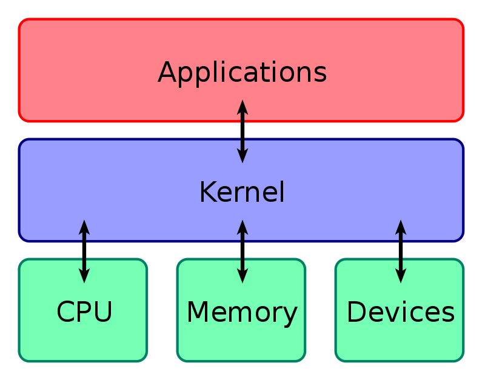
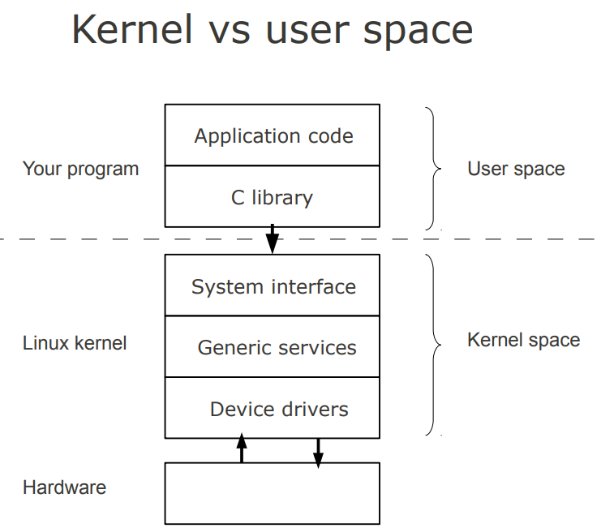
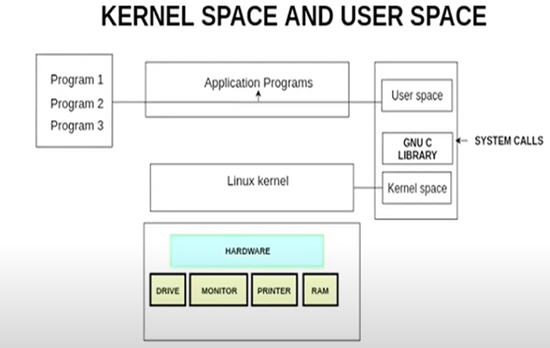

# Linux Operating System

## 1. Introduction to operating Systems (OS)

- An OS is a program that acts as an interface between a user of a computer and the computer hardware.
- OS is a system software that manages hardware and software resources and provide services for computer programs and make the computer into a useful tool for its users.
- Computer understand machine language, also known as machine code. Machine code is a set of binary instructions consisting of 1’s and 0’s.
- Your OS also works as a translator in your PC. It converts those 1s and 0s, value into a human readable language that user will understand.
- All computers and computer-like devices require operating systems, including your laptop, tablet, desktop, smartphone, smartwatch and router.

## 2. Primary Objective of OS

- Primary goals:
  - Convenience (windows)
    - Windows and Mac are the most convenient OS for the users.
  - Throughput (Linux)
    - Multiple tasks executed per unit time, it means we have running multiple applications and OS need to respond fast.
    - Respond fast in specific amount of time.

## 3. Major Functions of OS

- Resource Management
  - Resource management works when multiple users connected from a single machine, like server.
  - Especially it’s use where parallel users connected from a machine
- Process Management
  - If we have multiple applications/process running at a time like media player, browser, gaming app, OS manages it using CPU SCHEDULING.
- Storage Management
  - Store data in drive using file system.
- Memory Management
  - All process first come in RAM before execution
  - RAM allocate memory and send it to CPU
  - CPU executes the program/application
- Security Management
  - OS refers to specified steps or measures used to protect the OS from threat, viruses, worms, malware or remote hacker intrusions.
  - Check the authentication.

## 4. Why Linux?

- Free and Open Source
  - Linux is free and open source; you can see the source code used to create Linux (kernel)
- Stability and Reliability
  - Linux is Unix-based and Unix was originally designed to provide an environment that’s powerful, stable and reliable yet easy to use. Linux systems are widely known for their stability and reliability, many Linux servers on the Internet have been running for years without failure or even being restarted.
- Security
  - Linux is without doubt the most secure kernel out there, making LINUX based operating systems secure and suitable for servers
- Flexibility
  - Linux is so powerful and flexible. You can tune it to meet your server needs: it allows you to do whatever you want (of possible). You can install a GUI (graphical user interface) or simply operate your server via terminal only.
- Cost and Maintenance
  - Finally, the total cost of owing and maintaining a Linux server is lower compared to a Windows server, in terms of licensing fees, software/hardware purchase and maintenance costs, system support services and administrative costs.

## 5. What is Linux?

- An open-source operating system modelled on UNIX.
- Just like Windows XP, Windows 7, Windows 8, and Mac OS X, Linux is an operating system.
- An operating system is software that manages all of the hardware resources associated with your desktop or laptop.
- The operating system manages the communication between your software and your hardware. Without the operating system, the software wouldn't function.

## 6. Kernel and user space

- Kernel space is where the kernel (i.e., the core of the operating system) executes (i.e., runs) and provides its services.

  

- User space is that set of memory locations in which user processes (i.e., everything other than the kernel) run.

  

- One of the roles of the kernel is to manage individual user processes within this space and to prevent them from interfering with each other.
- Kernel space can be accessed by user processes only through the use of system calls

  

## 7. File System

- Linux organizes files using a hierarchical system.
- Files are stored in directories and these directories can also contain other directories.
- When you compare the Linux filesystem to Windows, you will find that there are no drive letters in Linux.

## 8. In Depth Introduction

- Linux is opensource
- At a time, 100+ companies and 1000+ developer on new release

## 9. Ubuntu Installation Guide

- Easy to use
- Easy to install
- Massive update and support
- `apt-get install <package name>`
- You cannot install as normal user without permissions

## 10. User Roles and SUDO

- User roles
  - Normal user
    - Create read and edit a file but no system changes
    - sudu su to login to root user
    - sudu gain all access for normal user
  - Super user
    - Can do system changes too.
    - Exit to leave root user

## 11. Command completion and history

- Use tab key to auto complete commands
- Double tab gives list of all commands linked to some command
- Ctrl + a move curser to beginning
- Ctrl + e move curser to end
- Backspace to remove
- Arrow left and right to move curser
- Arrow up and down for command history

## 12. Scripting

- Script is a program which a shell can interpret.
- Scripts are made for repetitive work
- Steps
  - touch simple.sh
  - vi simple.sh
  - i for insert mode
  - write code
    ```sh
    #!/bin/bash
    echo My first name : $1
    echo My middle name : $2
    echo My last name : $3
    ```
  - shift + :
  - wq
  - execute using `./simple.sh Hassan Ali Khan`

## 13. File Permission

- Numeric values used for permission
  - 0 for no permission
  - 1 for executable permission
  - 2 write permission
  - 4 read permission
- ls -l to find permissions on the file
  - Owner permission – Group permission – All users
- chmod 777 simple.sh to give all permissions
